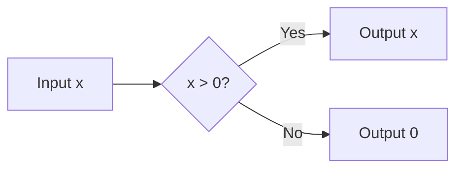

# Rectified Linear Unit (ReLU)

The **Rectified Linear Unit (ReLU)** is the most widely used activation function in deep learning, known for its simplicity and effectiveness in training deep neural networks.

## Mathematical Definition
$$f(x) = \max(0, x)$$

## Visualization


Or as a plot approximation:
```mermaid
xychart-beta
    title "ReLU Activation Function"
    x-axis [-5, -4, -3, -2, -1, 0, 1, 2, 3, 4, 5]
    y-axis "f(x)" [0, 5]
    line [0, 0, 0, 0, 0, 0, 1, 2, 3, 4, 5]
```

## History & Origins
- **First Proposed:** 2010 by Vinod Nair and Geoffrey Hinton in [Rectified Linear Units Improve Restricted Boltzmann Machines](https://www.cs.toronto.edu/~fritz/absps/relu_icml.pdf).
- **First Major Use:** Mainstream adoption followed the success of **AlexNet** (2012) in the ImageNet competition, where it significantly outperformed Tanh and Sigmoid by mitigating the vanishing gradient problem.

## Characteristics
- **Sparsity:** Neurons with negative input output exactly zero, leading to sparse representations.
- **Computational Efficiency:** Simple thresholding at zero is much faster than exponential calculations.
- **Dying ReLU Problem:** If a gradient becomes too large, a neuron might always output zero, effectively "dying."

[Back to README](../README.md)
