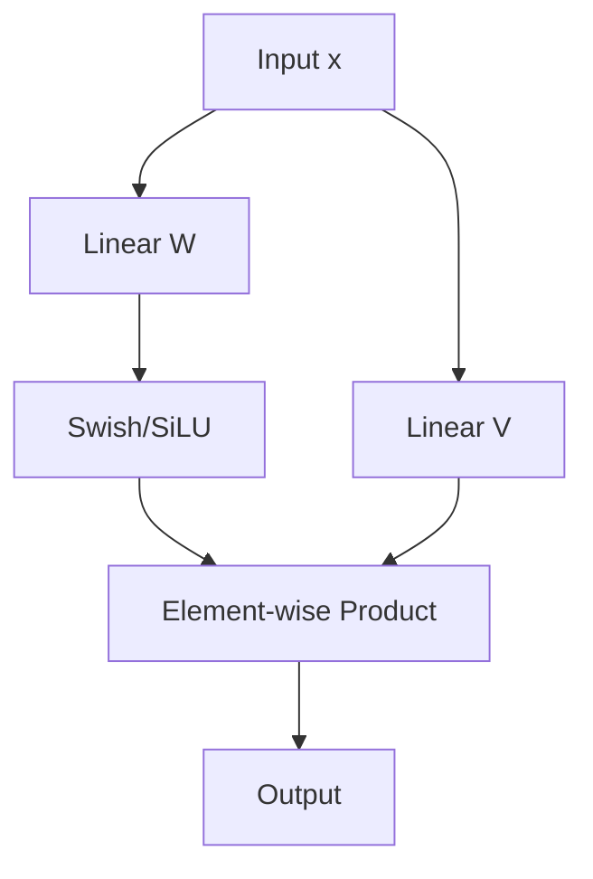

# SwiGLU

**SwiGLU** is a variant of the Gated Linear Unit (GLU) that uses the Swish (SiLU) activation function. It has become the standard for modern Large Language Models (LLMs).

## Mathematical Definition
$$\text{SwiGLU}(x, W, V, b, c) = \text{Swish}_1(xW + b) \otimes (xV + c)$$
In most LLM implementations, the bias terms are omitted.

## Visualization

## History & Origins
- **First Proposed:** 2020 by Noam Shazeer in [GLU Variants Improve Transformer](https://arxiv.org/abs/2002.05202).
- **First Major Use:**
  - **PaLM** (2022): Google's Pathways Language Model.
  - **LLaMA** (2023): Meta's open-weights LLM, which popularized its use across the open-source AI community.

## Characteristics
- **Hybrid Design:** Combines the gating mechanism of GLUs with the smoothness of Swish.
- **Performance:** Empirically outperforms GELU and ReLU in transformer architectures at scale.

[Back to README](../README.md)
